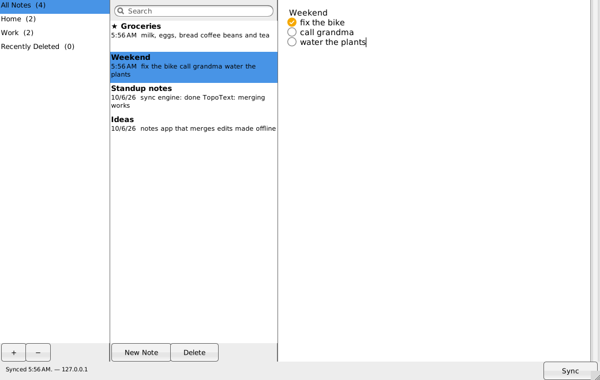
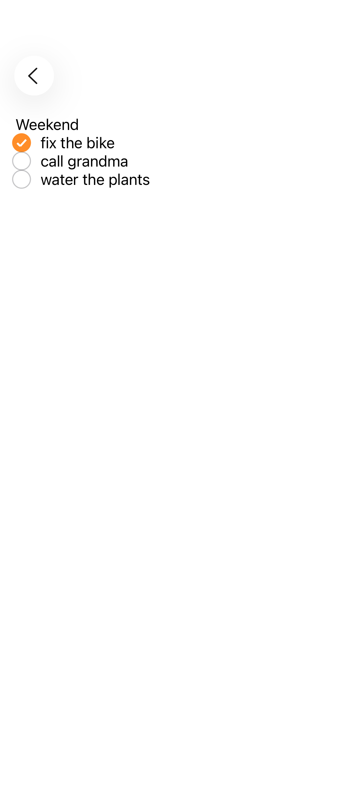

# SimpleNotes

A small Apple Notes: folders, notes in rich text with headings, lists and
checklists, search, pinning, Recently Deleted, and moving notes between
folders. It runs
on macOS and on Linux (AppKit, through GNUstep), and on iPhone and iPad.
Every note is kept on the device and works offline. Notes sync with a
server, `simplenotes-server`, which serves them over OData.

When the same note is edited on two devices that couldn't reach each other,
both edits end up in the note. The note's body is a [TopoText](../../README.md),
and [ODataSync](https://github.com/ashalkhakov/ODataKit/tree/master/Source/ODataSync)
merges it through `TTSyncResolver`. The note is not settled for one side.

| The AppKit app, on GNUstep (the Eau theme) | On iOS |
|---|---|
|  |  |

## What there is

| Part | Where | What |
|---|---|---|
| The device | `Shared/` | Foundation and Core Data only, shared by every app |
| The AppKit app | `AppKit/` | macOS and GNUstep: `MainMenu.xib`, `NotesWindow.xib` (folders, notes, the note), `TextPanel.xib` |
| The iOS app | `iOS/` | Folders, then a folder's notes, then the editor (`SNEditorViewController.xib`, with a format bar over the keyboard) |
| The server | `Server/SNServer.m` | ODataKit's server (HTTPServerKit, ODataService) with ODataSync's part of it |
| The model | `SimpleNotes.xcdatamodeld` | `Folder` and `Note`; the classes' properties are generated as each target builds (Codegen: Category/Extension), by Xcode or by FreeCoreData's momc |
| Tests | `Tests/` | The device against the service in one process; the text view's binding; migration from an older model; two devices through the running server; each app driven from within |

The device, in `Shared/`:

- **`SNNotes`**: the store (SQLite, with persistent history), the ODataSync
  engine, and the queries and changes the views make. A sync runs on its own
  thread while the views carry on. Saves made in the meantime wait for it
  to finish.
- **`SNNoteEditor`**: one open note's TopoText, a session with its own
  replica. Before the note is written again, the editor merges in what the
  last sync brought, and hands the resulting edits to the view.
- **`SNTextBinding`**: keeps a text view's `NSTextStorage` (AppKit's or
  UIKit's) and the editor's TopoText the same, in both directions. What the
  user types goes into the text as they type. What a sync merged comes into
  the storage as edits, and the selection moves along with them. It also
  follows Apple Notes' typing rules for lists (see "Lists and checklists").
- **`SNListLayoutManager`**: draws list markers and checkboxes beside the
  text, and tells which checkbox a click or tap landed on.
- **`SNResolver`**: merges a note's body; its title becomes the merged first
  line. Other properties are taken from whichever side changed them, or from
  the later writer if both did. An edit outlives a deletion that didn't see it.
- **`SNMigration`**: brings a store made by an older version of the model up
  to date when it opens (see "Model versions" below).

## Recently Deleted

Deleting a note moves it to Recently Deleted, as in Apple Notes:

- It leaves its folder's list and search. In Recently Deleted it's read-only
  and shows how many days it has left.
- **Recover** puts it back in its folder, or in All Notes if the folder is
  gone. Moving it to a folder also recovers it.
- **Delete Immediately**, or **Delete All**, removes it for good, on every
  device.
- After 30 days it's removed for good. Each device checks when it opens and
  after every sync.
- Deleting a folder moves its notes to Recently Deleted.

Deleting is an ordinary change to the note (its `deletedAt`), so it syncs and
merges like any other edit. A note deleted on one device while edited on
another ends up deleted on both, with the edit kept, ready to recover.

## Moving notes

On the Mac and GNUstep, use **File > Move To**, or drag a note onto a folder.
Dropping it on Recently Deleted deletes it. On iOS, swipe the note and choose
**Move**.

## Model versions

`SimpleNotes.xcdatamodeld` holds every version of the model; version 2 added
`Note.deletedAt`. To add another:

1. Add a version in Xcode (or copy the latest `.xcdatamodel` and name it
   `SimpleNotes 3.xcdatamodel`), and give it the next
   `userDefinedModelVersionIdentifier`.
2. Make it current in `.xccurrentversion`.
3. Run `Scripts/xcodeproj.py`.

Keep each change additive (new optional attributes, new entities), so a
lightweight migration covers it.

What happens when a store opens:

- **On a device**, `SNNotes` migrates its SQLite store to the current
  version before opening it. The migration keeps what ODataSync needs: the
  store's metadata (including its replica ID) and its history. So a change
  saved before the update and not yet sent still goes at the next sync. The
  previous store is kept beside the new one, as `.old`.
- **On the server**, a SQLite store is migrated the same way. A PostgreSQL or
  MariaDB store migrates itself, in place.
- **Devices not yet updated** keep syncing: they name their model's version
  with every request, and the server accepts their writes as they are.

Core Data's automatic migration can't do the device's part, because a store
holding ODataSync's entities wasn't made from any of the compiled models as
they are. `SNMigration` finds the right version and migrates it explicitly.

## Running it

The server, on this machine:

```sh
make -C Examples/SimpleNotes           # macOS: build/; GNUstep: obj/
build/simplenotes-server -StoreURL notes.sqlite -Port 8080 -Localhost NO
python3 Tests/seed.py http://127.0.0.1:8080/odata/      # a few notes to start with
```

Its settings are ois-serve's (`Port`, `Localhost`, sign-in through
`TrustedUserHeader` or `JWTIssuer`, and the rest of HTTPServerKit's). In
addition:

- `StoreType` can be `SQLite` (the default), `PostgreSQL`, or `MySQL` /
  `MariaDB`, using FreeCoreData's SQL stores. Give `StoreURL` as the
  database's URL:

  ```sh
  obj/simplenotes-server -StoreType PostgreSQL -StoreURL postgresql://notes:secret@db/notes
  ```

  Delta links need persistent history. FreeCoreData's SQL stores keep it on
  GNUstep, but not on Apple's Core Data, so a server on macOS uses SQLite.
- `StoreURL Temporary` is a throwaway store, for trying things out.
- `AllowAnonymous NO` refuses requests that don't say who they're from,
  once a sign-in is set. Every device syncs every note: one shared notebook.

The apps:

- **macOS**: open `TopoText.xcworkspace` (ODataKit checked out beside this
  repository, at `../ODataKit`) and run the **SimpleNotes** scheme. Then
  choose **SimpleNotes > Server…** and give `http://127.0.0.1:8080/odata/`.
- **iPhone or iPad**: the **SimpleNotes-iOS** scheme. Set the address with
  the server button at the top left. The simulator reaches the Mac at
  `127.0.0.1`. To run on a device, put `DEVELOPMENT_TEAM = <your team>` in
  `iOS/Local.xcconfig`.
- **GNUstep**, with TopoText, ODataKit and FreeCoreData installed:

  ```sh
  make -C Examples/SimpleNotes && openapp Examples/SimpleNotes/SimpleNotes.app
  ```

  It uses the Eau theme when it is installed (gnustep-patches'
  `build-gnustep.sh` builds it, as for our other apps). A `GSTheme` default
  of your own takes precedence.

To try two devices on one Mac or Linux machine, give a second instance a
store of its own: `SimpleNotes -SNStore /tmp/second.sqlite`.

## Checked

```sh
make -C Examples/SimpleNotes check
```

This runs four things:

- **The tests.** Two devices and the service run in one process: edits made
  apart, a deletion against an edit, an open editor merged while its own
  typing is kept, and the text view's binding both ways.
- **Two devices through the server, over HTTP**
  (`Tests/serve-and-check.sh`, `SimpleNotes --check`). With `SN_STORE_ARGS`,
  the server stores in PostgreSQL or MariaDB instead.
- **The AppKit app driven from within** (`SimpleNotes --self-test`, under
  `xvfb-run` where there's no display). A note is chosen in the list, text
  is typed into the window's text view, and Bold is sent up the responder
  chain. Two lines become a checklist, a click on the first checkbox ticks
  it, and Return starts a third item. A second device must see all of it.
  With `SN_SELF_TEST_SNAPSHOT=<file.png>`, the window is saved as a picture
  at that point; that's how the screenshots above were made.
- **The iOS app's self-test, in a simulator** (`Tests/ios-self-test.sh`;
  macOS only). It does the same through the iOS view controllers.

CI runs all of these: macOS and iOS against Apple's Core Data, and GNUstep
against FreeCoreData, SQLite, PostgreSQL and MariaDB.

## Rich text

A note's text uses plain values that sync and merge the same way
everywhere. `SNRichText` turns them into each system's fonts, indents and
list markers, and back.

- **Per character:** `bold`, `italic`, `underline`, `strike`.
- **Per paragraph:** `style` (`title`, `heading`, `subheading`, or `mono`;
  none is body), `list` (`bullet`, `dash`, `number`, or `check`), `checked`,
  and `indent` (1 to 8).

Character formatting is per character, and the last writer wins per
attribute, as in TopoText. Bold applied to a line does not spread to text
someone else typed into it at the same time.

Paragraph formatting is kept on every character of the paragraph,
including its newline. When those disagree after a merge, the newline's
value wins (TopoText's `Paragraphs` category), and the view shows the whole
paragraph that way. So a line that one device turned into a checklist item
stays one when another device typed into it meanwhile. A checklist item's
`checked` is a single register, so the last tick or untick wins.

## Lists and checklists

The Format menu (AppKit) and the format bar's menus (iOS) have Apple Notes'
paragraph styles and lists, with the same shortcuts: Title ⇧⌘T, Heading ⇧⌘H,
Subheading ⇧⌘J, Body ⇧⌘B, Monostyled ⇧⌘M, Bulleted List ⇧⌘7, Dashed List
⇧⌘8, Numbered List ⇧⌘9, Checklist ⇧⌘L, Mark as Checked ⇧⌘U, and indentation
with ⌘] and ⌘[.

Typing works as in Apple Notes:

- Return in a list item starts the next item. A new checklist item starts
  unticked.
- Return on an empty item ends the list, or outdents it first if it is
  indented.
- Delete at the start of an item removes its marker. A second Delete joins
  the line to the one above, which keeps the upper line's formatting.
- Tab and Shift-Tab indent and outdent an item.
- Return after a title, heading or subheading starts a body line.

Clicking (or tapping) a checkbox ticks it. Numbered items count up within
their indent level; items indented further don't interrupt the count.

## Not yet

- **One shared notebook.** A notebook per user means a handler on the
  server (an `ODataSyncSetHandler` that filters by the signed-in user).
- **Peer sync between devices.** ODataSync can do it (`ODataSyncPeerServer`).
  ODataKit's Device app shows how; SimpleNotes doesn't have it yet.
- Attachments, tables, nested folders, moving checked items to the bottom,
  and undo across a merge (the undo stack is cleared when a sync changes the
  open note).
